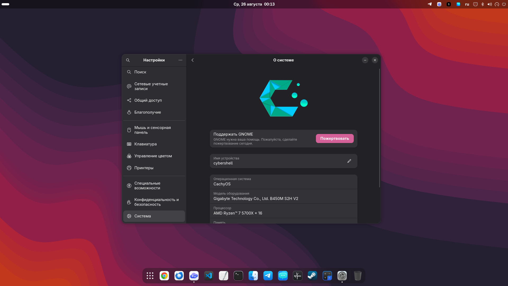

# GNOME macOS Dock

Полностью воспроизводимая конфигурация плавающей нижней панели GNOME: настоящее
размытие, нейтральный полупрозрачный фон, увеличение значков, отдельная логика
для каждого монитора и активный набор значков WhiteSur-dark.

Сценарий намеренно не сбрасывает настройки верхней панели, обзора и другие
параметры GNOME, не относящиеся к нижнему Dock.

[English README](README.md)



## Что получится

- компактная панель по центру снизу с иконками 40 px;
- нейтральный фон `#202020` с непрозрачностью `0.24`;
- динамическое размытие Blur My Shell: радиус 30, яркость 0.82;
- скругление 18 px и около 10 px между фоном панели и краем экрана;
- плавное увеличение и соседняя «волна» Flourish при наведении;
- один короткий отскок длительностью около 360 мс при запуске;
- избранное и корзина только на главном мониторе;
- на боковых мониторах — только приложения с окнами на конкретном экране;
- главная панель скрывается только за развёрнутым или полноэкранным окном;
- один рабочий стол без переключателя и элементов рабочих столов;
- WhiteSur, включая локальные согласованные SVG для VK, eXpress и Codex.


## Установка

Сначала просмотрите сценарий, затем выполните:

```bash
git clone https://github.com/edwardgushchin/gnome-macos-dock.git &&
cd gnome-macos-dock &&
./install.sh
```

Для установки без вопроса подтверждения:

```bash
./install.sh --yes
```

После установки один раз выйдите из GNOME и войдите снова, затем проверьте:

```bash
./status.sh
```

Поддерживаются GNOME Shell 46–50. Эталонная среда — GNOME 50.4, Wayland.
Сценарий не использует `sudo` и не устанавливает системные пакеты.

## Безопасность

Перед изменениями автоматически сохраняются расширения, все связанные dconf
настройки, включённые расширения, избранное, режим рабочих столов, WhiteSur и
изменяемые launcher-файлы. Источники расширений закреплены по версиям и
проверяются по SHA-256.

Откат к последней копии:

```bash
./restore.sh latest
```

Резервные копии хранятся локально с закрытыми правами в
`${XDG_STATE_HOME:-~/.local/state}/gnome-macos-dock/backups/` и не удаляются
после восстановления.

## Полезные варианты

```text
--dry-run                только проверить источники, суммы и патчи
--keep-favorites         не менять избранные приложения
--skip-icons             не устанавливать WhiteSur
--main-monitor NAME      явно выбрать разъём главного монитора
--force-gnome-version    разрешить непроверенную версию GNOME
```

Без `--main-monitor` используется основной монитор целевой системы, поэтому
конфигурация не привязана к имени разъёма исходного компьютера.

Подробности находятся в [справочнике настроек](docs/SETTINGS.md),
[архитектуре](docs/ARCHITECTURE.md) и
[руководстве по диагностике](docs/TROUBLESHOOTING.md).

## Авторство и лицензии

Проект создан и поддерживается
[Эдуардом Гущиным](https://github.com/edwardgushchin). Полная атрибуция
Dash to Dock, Blur My Shell, Flourish, Just Perfection и WhiteSur приведена в
[THIRD_PARTY.md](THIRD_PARTY.md).

Собственные сценарии, документация и SVG распространяются по GPL-3.0.
Сторонние компоненты и патчи сохраняют исходные лицензии.
